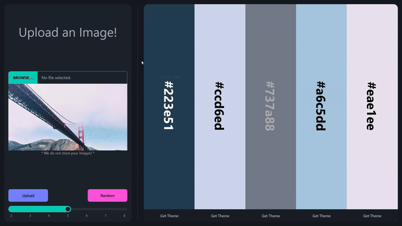

# ColorSchemes



The primary objective of our project is to provide a convenient SaaS where users can generate a theme for their UX purposes. The project targets designers and creative people. We want fashion designers, user experience developers, event planners, product innovators and social media creators to use our website and are able to reproduce colors and themes that they envision in their heads.\
The website provides the frontend interface for users to upload an image which can be a brand logo, the view from their apartment, cloth accessories, or a random photograph. The server will then process the image and extract colors which make it up. Then our GAN generates a theme of five color swatches, and relays it back to the user.

Future additions may include a generative model to produce AI generated image mockups of sample objects.

Link to the dataset: [Hugging Face](https://huggingface.co/datasets/huggingface-projects/color-palettes-sd)

## Installation
To install the project, follow these steps:
1. Clone the git repository
```bash
git clone https://github.com/yvs2701/ColorSchemes.git
```

2. Install dependencies with pip
```bash
pip install -r requirements.txt
```

3. Install the dependencies for the frontend
```bash
cd frontend
npm install
```

3. Run the Flask server
```bash
python -m flask --app server run
```

4. Run the frontend
```bash
cd frontend
npm run dev
```
---

Additionally, To build the frontend you can use
```bash
cd frontend
npm run build
```
After which flask server can be run to serve the files from the build folder.
